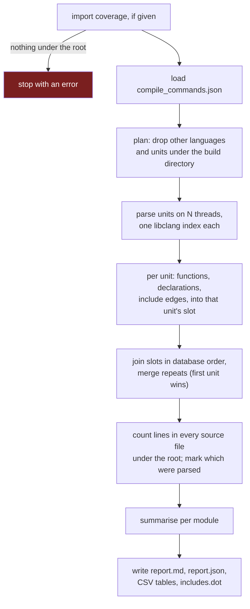

# Architecture

Tezcatl is a C++20 command-line tool built on libclang's C API, CMake and Ninja. This page
describes the structure that exists today. [Testing](testing.md) describes how it is
checked.

## Modules

| Module | Holds |
|---|---|
| `parse` | libclang: loading the compilation database, parsing units, and finding function definitions, public declarations and include directives, as written in the source |
| `metrics` | measures that need nothing but tokens and numbers: lines of code, cyclomatic complexity, Halstead, and the summary statistics |
| `analysis` | where the two meet: it measures the functions `parse` finds |
| `coverage` | reading gcov JSON, lcov and llvm-cov JSON, and merging them |
| `graph` | a directed graph and its cycles (Tarjan's algorithm) |
| `config` | module maps and test globs |
| `scan` | globs, paths and walking a source tree |
| `report` | naming files, summarising by module, and writing Markdown, JSON, CSV and DOT |
| `cli` | the commands, and the parallel scan of a project |

The layers run one way: `parse` knows nothing of `metrics`, `metrics` depends on `parse` only for
tokens, and `analysis` joins them. The measured graph, with no module in a cycle, is in Tezcatl's own
report, which CI regenerates on every push.

## One run of `tezcatl report`

Coverage is read first, so data that maps to nothing fails at once rather than after the slow part.

## Decisions that shape the output

**Measured as compiled.** Every unit is parsed by clang with the project's own flags, so an `#if`
branch the configuration disables is not measured. The parser is clang even for a gcc or MSVC build,
so code that tests for the compiler takes clang's branch. The limits are in
[Metric definitions](../metrics.md).

**The same inputs give the same bytes.** Results are joined in database order whatever the number
of threads, repeats are merged with a stable sort so the first compile command wins on every
standard library, and nothing depends on the time of the run. Every output is identical at `-j 1`
and `-j 16`.

**Nothing is silently partial.** A unit that fails to parse makes the run exit 1 and the report say
it is incomplete. Files no unit reached are counted and named, database entries for other languages
are counted and skipped, and coverage that maps to no project file is an error.
